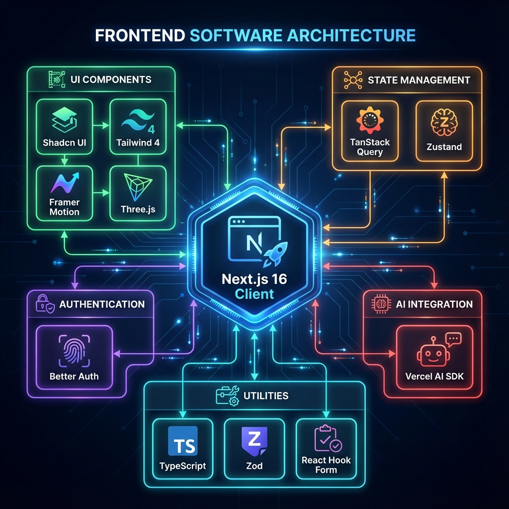

<div align="center">
  
  <h1>Expense Tracker</h1>
  <p>A modern, AI-powered, open-source expense tracker built to provide a seamless and intuitive financial management experience.</p>

  <div>
    
    
    
    
    
    
  </div>

  <p>
    <a href="#-features-showcase">Features</a> •
    <a href="#-why-choose-this-project">Why Us?</a> •
    <a href="user-guide.md">User Guide</a> •
    <a href="#-tech-stack--architecture">Tech Stack</a> •
    <a href="#-local-development">Getting Started</a> •
    <a href="#-deployment">Deployment</a> •
    <a href="#-contributing">Contributing</a>
  </p>
</div>



## 🚀 Features Showcase

This application is packed with features designed for comprehensive financial management.

### 👤 User & Account Management

- ✅ **Secure Authentication:** JWT-based login, registration, and password reset flows.
- ✅ **Profile Customization:** Update user details, profile picture, and preferred currency.
- ✅ **Multi-Account Support:** Manage multiple financial accounts seamlessly.
- ✅ **Account Sharing:** Securely share accounts with other users and manage access permissions.

### 💸 Transaction & Data Management

- ✅ **CRUD Operations:** Full support for creating, reading, editing, and deleting transactions.
- ✅ **Advanced Filtering & Sorting:** Easily find transactions with powerful filters (date, category, type, text search) and sorting options.
- ✅ **Data Import/Export:**
  - **Import:** From XLSX templates and PDF bank statements.
  - **Export:** Filtered transaction data to XLSX or CSV.
- ✅ **Categorization:** Smart category management with an intuitive combobox and inline creation.

### 📊 Analytics & Visualization

- ✅ **Interactive Dashboard:** A fully customizable dashboard with widgets for:
  - Financial Snapshot (Income, Expenses, Net Worth)
  - Spending Breakdowns (by category)
  - Budget vs. Actual Tracking
  - Investment & Debt Summaries
  - Account Balance Lists
- ✅ **Rich Charts & Graphs:** Powered by Recharts for clear, beautiful data visualization.
- ✅ **Account-Specific Analytics:** Dive deep into the financial trends of a single account.
- ✅ **Financial Statements:** Generate PDF or XLSX statements on demand.

### 🎯 Financial Planning

- ✅ **Budgeting:** Set monthly or yearly budgets for specific categories and track your progress.
- ✅ **Savings Goals:** Create and manage savings goals, tracking your contributions and progress visually.
- ✅ **Debt Management:** Track loans (taken or given) with details on interest, duration, and payment status.
- ✅ **Investment Tracking:** Monitor investment accounts, individual holdings, and overall portfolio performance.

### 🎨 Visual Experience

- ✅ **Immersive 3D Elements:** Interactive 3D visualizations powered by Three.js and React Three Fiber for a modern, engaging feel.
- ✅ **Smooth Animations:** Powered by Framer Motion and GSAP for a polished, premium user experience.

### 🤖 AI Assistant

- ✅ **Bring Your Own Key (BYOK):** Connect your preferred AI provider (OpenAI, Google, Anthropic, etc.) using your own API key for maximum privacy and control.
- ✅ **Natural Language Commands:** Interact with your finances using plain English. Ask the AI to add transactions, list expenses, or provide financial summaries.
- ✅ **Secure Tool Integration:** The AI securely interacts with the backend API to perform actions on your behalf.
- ✅ **Context-Aware Suggestions:** Receive smart, actionable suggestions based on your conversation.
- ✅ **Dynamic Model Selection:** Choose from a list of available models from your selected provider.

---

## 🌟 Why Choose This Project?

- **Modern Tech Stack:** Built with the latest and greatest web technologies like Next.js 16, React 19, and Tailwind CSS 4 for a fast, reliable, and scalable application.
- **Exceptional User Experience:** A huge emphasis has been placed on creating a clean, intuitive, and responsive UI/UX, powered by the elegant Shadcn UI component library.
- **AI-Powered & User-Controlled:** Goes beyond simple tracking by integrating a powerful AI assistant that operates using **your** API key, ensuring your data's privacy and giving you full control over AI costs and provider choice.
- **Extensible & Open Source:** The codebase is clean, well-structured, and ready for new features. Contributions are welcome!
- **Data-Driven Insights:** Powerful analytics and visualizations help you understand your financial health at a glance.

---

## 🛠️ Tech Stack & Architecture

This project uses a modern, type-safe, and performant technology stack.

| Category          | Technology                                                                  | Role & Purpose                                                             |
| ----------------- | --------------------------------------------------------------------------- | -------------------------------------------------------------------------- |
| **Framework**     | [Next.js](https://nextjs.org/) 16 (App Router)                              | The core React framework for the web.                                      |
| **UI Library**    | [React](https://react.dev/) 19                                              | The foundational library for building the interactive user interface.      |
| **Styling**       | [Tailwind CSS](https://tailwindcss.com/) 4                                  | A utility-first CSS framework for rapid, custom UI development.            |
| **Components**    | [Shadcn UI](https://ui.shadcn.com/)                                         | A collection of beautifully designed, accessible, and unstyled components. |
| **Animations**    | [Framer Motion](https://www.framer.com/motion/) & [GSAP](https://gsap.com/) | Powerful libraries for complex 2D and 3D animations and transitions.       |
| **3D Elements**   | [React Three Fiber](https://docs.pmnd.rs/react-three-fiber/)                | Renders 3D graphics using Three.js in a React-friendly way.                |
| **Data Fetching** | [TanStack Query](https://tanstack.com/query/v5)                             | Manages all server state: fetching, caching, and updating data.            |
| **Auth**          | [Better Auth](https://www.better-auth.com/)                                 | A comprehensive authentication library for secure user management.         |
| **AI SDK**        | [Vercel AI SDK](https://sdk.vercel.ai/docs)                                 | Seamlessly integrates AI capabilities for the chat assistant.              |
| **Forms**         | [React Hook Form](https://react-hook-form.com/) + [Zod](https://zod.dev/)   | Type-safe form validation and management.                                  |
| **Charting**      | [Recharts](https://recharts.org/en-US/)                                     | A composable charting library for data visualizations.                     |

---

## ⚙️ Local Development

Follow these steps to get the project running on your local machine.

### 1. Prerequisites

- [Node.js](https://nodejs.org/en) (v18.17 or higher)
- [Bun](https://bun.sh/) (v1.0 or higher)
- A running instance of the backend API service.

### 2. Clone the Repository

```bash
git clone https://github.com/Utsav173/expense-tracker.git
cd expense-tracker
```

### 3. Install Dependencies

This project uses `bun` for package management.

```bash
bun install
```

### 4. Configure Environment Variables

Create a `.env.local` file in the root of the project by copying the example file:

```bash
cp .env.example .env.local
```

Now, open `.env.local` and add the URL for your running backend API:

```dotenv
# .env.local

# URL of your running backend service (Required)
NEXT_PUBLIC_API_BASE_URL=http://localhost:8000
```

### 5. Run the Development Server

```bash
bun dev
```

The application will be available at **http://localhost:3000**.

---

## 🌐 Deployment

The easiest way to deploy this Next.js application is to use the [Vercel Platform](https://vercel.com/new?utm_medium=default-template&filter=next.js&utm_source=create-next-app&utm_campaign=create-next-app-readme).

- **Connect Your Git Repository:** Import your project into Vercel from your Git provider (GitHub, GitLab, etc.).
- **Configure Environment Variables:** Add the `NEXT_PUBLIC_API_BASE_URL` to your Vercel project's environment variables.
- **Deploy:** Vercel will automatically build and deploy your application.

---

## 🙌 Contributing

Contributions are what make the open-source community such an amazing place to learn, inspire, and create. Any contributions you make are **greatly appreciated**.

1.  Fork the Project
2.  Create your Feature Branch (`git checkout -b feature/AmazingFeature`)
3.  Commit your Changes (`git commit -m 'Add some AmazingFeature'`)
4.  Push to the Branch (`git push origin feature/AmazingFeature`)
5.  Open a Pull Request

---

## 📄 License

Distributed under the MIT License. See `LICENSE` for more information.
